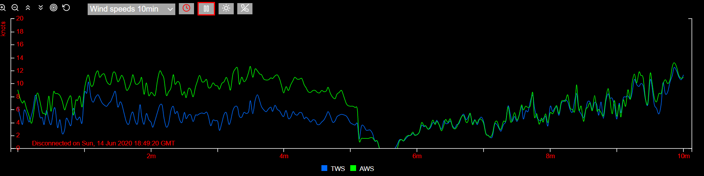
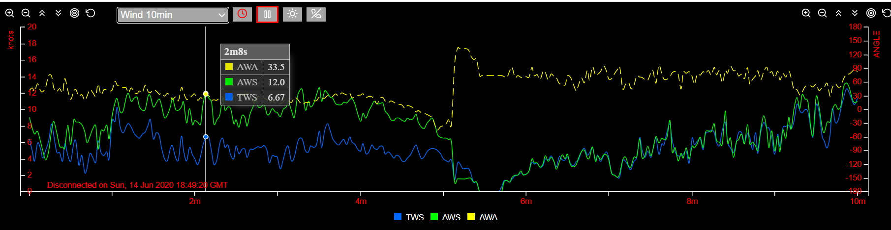

# Signalk-stripcharts - Generate strip charts from Signal K live boat data. 


  > New in version 0.1.0: [Charting past data from InfluxDB](#charting-past-data-from-influxdb)
  
  > New in version 0.0.8: [Filtering by sources](#filtering-by-sources), e.g `path="navigation.speedOverGround[gps.1]", ...`

## Introduction

A stripchart displays the most recent boat data from one or more Signal K paths as a graph along a time axis (x-axis).
Legends identify by abbreviations what paths are charted. Here is a chart with a 10 minutes time window plotting the true wind speed (TWS) and apparent wind speed (AWS):



The above chart has a y-axis on the left hand side. Optionally, as shown on the chart below (right hand side), a y2-axis may also be defined with its own unit. The dotted line corresponds to the plot according to the y2 axis, here the apparent wind angle (AWA).



The browser window can display two such charts on top of each other. For instance you may have wind speeds on the top chart and boat speeds on the bottom chart, or wind speeds with two different time windows, say 10 minutes and 24 hours. Those two charts can be selected with a dropdown list from a set of active charts.

This documentation first explains how to chart live data from Signal K server.
Then it will explained how past boat data from InfluxDB, a time series database, can be queried and charted.

Now it's time to install signalk-stripcharts and start using the default charts specifications provided.

## Table of contents

- [Signalk-stripcharts - Generate strip charts from Signal K live boat data.](#signalk-stripcharts---generate-strip-charts-from-signal-k-live-boat-data)
  * [Introduction](#introduction)
  * [Table of contents](#table-of-contents)
  * [Installation](#installation)
    + [Install as Webapp from Signal K Dashboard](#install-as-webapp-from-signal-k-dashboard)
    + [Install on a node server - typically the boat Signal K server](#install-on-a-node-server---typically-the-boat-signal-k-server)
    + [Install on a client device](#install-on-a-client-device)
  * [Basic usage](#basic-usage)
    + [y- and y2-axis buttons](#y--and-y2-axis-buttons)
    + [Drop-down list](#drop-down-list)
    + [Main buttons](#main-buttons)
  * [How it works](#how-it-works)
  * [Customization](#customization)
    + [Chart specifications](#chart-specifications)
      - [Derived data](#derived-data)
      - [Filtering by sources](#filtering-by-sources)
      - [Legends and lines colors](#legends-and-lines-colors)
    + [Unit conversion](#unit-conversion)
    + [General options](#general-options)
  * [Charting past data from InfluxDB](#charting-past-data-from-influxdb)
    + [General description](#general-description)
    + [Install InfluxDB and create a database](#install-influxdb-and-create-a-database)
    + [Optimize with retention periods and constant queries](#optimize-with-retention-periods-and-constant-queries)
    + [RPs and sampling periods are also declared in the options](#rps-and-sampling-periods-are-also-declared-in-the-options)
    + [Signalk to InfluxDB Plugin](#signalk-to-influxdb-plugin)
    + [Usage in live mode and past mode](#usage-in-live-mode-and-past-mode)
    + [InfluxDB and filtering by sources](#influxdb-and-filtering-by-sources)
  * [Browser compatibility](#browser-compatibility)
  * [CPU and memory requirements on the client side](#cpu-and-memory-requirements-on-the-client-side)
  * [Troubleshooting](#troubleshooting)
  * [Limitations](#limitations)
    + [To-do functional](#to-do-functional)
    + [To-do technical](#to-do-technical)
  * [Dependencies included and licences](#dependencies-included-and-licences)
  * [Credits](#credits)

<small><i><a href='http://ecotrust-canada.github.io/markdown-toc/'>Table of contents generated with markdown-toc</a></i></small>

## Installation 

Signalk-stripcharts comes with all required dependencies (including c3 charting library, d3 visualization library and InfluxDB client library).

Choose one of the following 3 methods as applicable or desired:

### Install as Webapp from Signal K Dashboard

*This is the recommended set up*

If [Signal K node server](https://github.com/SignalK/signalk-server-node) is installed on your server:
- login to the Signal K dashboard
- open the left hand side menu
- select `Appstore`, then `Available` and find `ignalk-Stripcharts` (if not found, it is probably already installed)
- click on the install icon next to the version number
- when installation is finished, click on the dashboard `Restart` button

You can now start signalk-stripcharts launcher from the dashboard `Webapps` menu.

### Install on a node server - typically the boat Signal K server
- Use npm: `[sudo] npm install signalk-stripcharts`

This will install signalk-stripcharts under the closest node_modules folder higher up in the hierarchy.

<div align="right"><sup><a  style="color:red;" href="#table-of-contents">↥ back to TOC</a></sup></div>

### Install on a client device
- Download the [ZIP file](https://github.com/edefalque/signalk-stripcharts) and unzip it in a folder.

(by default, it will be installed in a folder named `signalk-stripcharts-master`; rename folder `signalk-stripcharts`)

## Basic usage

Start the launch menu:
- **If installed as a Signal K Webapps**: from your client or on the Signal K server, access the Signal K dashboard (e.g. *`mysignalkserveripaddr`*`:3000/signak` or `localhost:3000/admin`), then start Signalk-Stripcharts from the dashboard `Webapps` menu.

You may also:
- **If installed on a (Signal K) node server**: from your client browser enter url  *`mynodeipaddr:port`*`/signalk-stripcharts`
- **If installed on a client**: double click on *`...path...`*`/signalk-stripcharts/index.html`

On the launch menu you can choose the Signal K server (same or distinct from the node server where signalk-stripcharts is installed) and choose a set of charts, then push the `Launch signalk-stripcharts` button. If you are connected to the Internet try first with the default selections of the launch menu.

When the charts are displayed:
- hover on a legend: the corresponding plot is highlighted, the others dimmed; the corresponding Signal K path is displayed above the legend
- hover on a plot line, a tooltip is diplayed with the values corresponding to the legends
- by clicking on a legend you can toggle the dim status of the legend and of the corresponding plot

You may wish to bookmark the launched page(s) for easier later launching. Modify the query parameters `server` & `specs` as needed, e.g. if you have defined your own charts specifications (see later section "How it works").

The following sections explain signalk-stripcharts accessing and charting live data  only provided by a Signal K server: this is the default configuration at installation. A [later chapter](#charting-past-data-from-influxdb) will explain how to set up an InfluxDB database to store historical boat data in order to chart it with signalk-stripcharts.

### y- and y2-axis buttons

These buttons affect the size and position of the plotted lines corresponding to the axis:


From left to right: 
- zoom in
- zoom out
- raise the plot lines (y-axis range is shifted)
- lower the plot lines
- try to center the plot lines at present time
- reset to the initial scale and position settings

These buttons appear also on top of the right hand side y2 axis if used.

### Drop-down list
You can select any chart in the set for display.
If you choose `none` the other chart will be displayed on the whole window (similar effect if the same chart is selected twice).

### Main buttons


From left to right:
- toggle pause/play plotting
- toggle day/night display
- disconnect from Signal K server (reload the page if you want to connect again)

They apply to the whole window.

<div align="right"><sup><a  style="color:red;" href="#table-of-contents">↥ back to TOC</a></sup></div>

## How it works

A chart contents and rendition is governed by the **chart specifications**, **unit conversion** and some **general options**.

In Signal K, data types are identified as paths: e.g. the true wind speed is identified by the path `environment.wind.speedTrue`.

A chart is primarily specified by:
- a name
- the length of the time axis (`timeWindow`); typically 10 minutes, 2 hours or 24 hours
- the averaging period (`avgInterval` explained below)
- the y axis range and unit (unit conversion is taken care of)
- the same properties for the optional y2 axis
- the list of Signal K paths to be charted and corresponding abbreviated legends

For each path the charted value can be the average (`AVG`), the maximum (`MAX`) and/or the minimum (`MIN`) of the values received from Signal K during the averaging period. The averaging period (`avgInterval`) should be set such that the ratio `timeWindow`/`avgInterval` is between 300 and 1000 (i.e. a reasonable number of plots along the `timeWindow`); `avgInterval` must be longer than the sampling period defined in the Signal K subscription period (`subscribePolicy.period` option), which is typically 1 second. By default, the chart is refreshed every `avgInterval` (provided that some new data has come for that chart).
When data stops coming for a particular path, the corresponding plot line is interrupted indicating probably that the corresponding instrument was disconnected or switched off.

A chart specification is provided as a JavaScript object.
Here is the specification for the chart shown at the top of this document:

```javascript
const Wind_speeds_10min = 
    // for JavaScript variables naming rules see https://javascript.info/variables#variable-naming
    { stripChartName: "Wind_speeds_10min",   // use preferably the same as the containing object name
        timeWindow: 600,            // 10min in seconds
        avgInterval: 2,             // 2 sec
        intervalsPerRefresh: 2,     // default 1
        x: { label: "min/sec ago", tickCount: 11 },   // a tick every min (10, + 1 for zero)
        y: { unit: "Knot" },
        paths: 
        [
            { path: "environment.wind.speedTrue", AVG: "TWS" },  // average is plotted, legend is "TWS"
            { path: "environment.wind.speedApparent", AVG: "AWS" }      
        ]
    }
;
```

By default, the chart is refreshed every `avgInterval` (provided that some new data has come); however refreshing can be made slower with the `intervalsPerRefresh` property in order to spare some processing.

Related chart specification objects are grouped into a set.

When the application is started as an url, the following "query" parameters must be provided:
- `server` with the address and port of the Signal K server (defaults to the address & port the page is loaded from)
- `specs` with the file name containing the chart specifications set (without .js extension).

The application subscribes to the Signal K server deltas for all the paths in the set. The values are then continuously collected and aggregated for all charts in a set (using the streaming WebSocket API).

At any one time, two charts can be displayed as selected by the user from the drop down lists.
If the user selects `none` in one of the drop down lists, the remaining chart is extended to the whole window area.

Charts can be paused by clicking . When paused, data collection continues "behind the scene". And the charts display will catch up when  is clicked. When the chart window is minimized or not in view, the charts are paused likewise and will catch up when brought to view. This minimizes processing load.

When the window is closed it is disconnected from Signal K and the buffers are "lost". In order to reconnect reload the page.
(Persistency is only provided with the InfluxDB option explained further down) 

The charts specifications sets are each stored in a .js file in the `./specs` folder.
The following specifications files are provided at installation:
- `sail.js`
- `environment.js`
- `engines.js`

Each of them can be started in its own browser tab and run concurrently.

In a specification file, a chart specification can be derived from another chart and only the properties that differ need to be specified (e.g. a two-hours chart can be derived from a ten-minutes chart, with most of the properties inherited). Inheritance is provided at the first level of properties only; this means in particular that to add, modify or delete a path property, you must provide a new `paths` (plural) property with all its `path` (singular) property.

<div align="right"><sup><a  style="color:red;" href="#table-of-contents">↥ back to TOC</a></sup></div>

## Customization
Currently, customization is easy if the package is installed on the client, but less if it is installed on a server as the specs files may then be less easily accessible. If installed on a Raspberry PI from Signal K Appstore, they will probably be in `$HOME/.signalk/node_modules/signalk-stripcharts/specs/`.

### Chart specifications
The specifications files are installed in `./signalk-stripcharts/specs/`. Ample comments are provided for those features that were not explained above.

New specifications files can be easily derived from those provided at installation. Copy them under another name and edit them with a text editor, or better with a code editor such as Geany or Visual Studio Code. 

The launch menu has a button that lists all paths and sources currently provided by the selected Signal K server. Switch on all your instruments and systems in order to obtain a full list of what you can chart.

#### Derived data
Some path values are provided to Signal K by the instruments; some other path values may need to be derived. E.g. true wind speed, if not provided by the instruments, can be derived from apparent wind speed, apparent wind angle and speed over ground.

Use the following Signal K dashboard menus:
- `Server/Plugin Config/Derived Data` in order to configure and start path derivation from existing paths; see https://github.com/SignalK/signalk-derived-data (you may have to instal the plugin first from Signal K `Appstore`)
- `Data Browser` in order to visualize the active and derived paths with their current values

#### Filtering by sources
Different sources may provide data for the same path; as needed, the `path` property may be extended to filter a specific source, e.g. `navigation.speedOverGround[gps.1]`. The sources corresponding to a path on your Signal K server can be obtained from the launch menu provided that the corresponding instruments are on and connected. A certain path may be listed several times in the chart specs, e.g.:
```javascript
{ path: "navigation.speedOverGround[gps.1]", AVG: "SOG1" },
{ path: "navigation.speedOverGround[gps.2]", AVG: "SOG2" },
{ path: "navigation.speedOverGround", AVG: "SOGx" },
```
The first two "path lines" will collect data each respectively from `gps.1` and from `gps.2`. The third line will collect SOG data from all sources including the sources identified in line 1 and 2. If a path line collects data from different poorly calibrated sources, the plot line  might be "jumpy" (note: the computed average will be influenced by the frequency at which the data is provided by each source).

An example is provided in [sources_filtering_example.js](./specs/sources_filtering_example.js)  (read comments in the file before running: it runs on a test log file provided with Signal K node server).

#### Legends and lines colors
Colors can be specified per legend at the bottom of the chart specifications file in order to insure consistency accross multiple charts of a same set. See [sail.js](./specs/sail.js) for how to assign colors.

If not provided, colors will be assigned automatically by the c3 library.

### Unit conversion
[units.js](./specs/units.js) provides the list of Signal K units and charting units (not yet a complete set), with the conversion factors and algorithms.
It also provides the following default properties for the y and y2 axis as a function of the charting unit:
- `label`
- range (`min` and `max`)
- `tick.count` and `tick.format`

Those can be overridden in the chart specs.

A special unit `Percent` is provided. It allows to plot values of different units on a same "Percent" y or y2 axis by providing reference values in the Signal K unit for 0% and for 100%. See [engines.js](./specs/engines.js) for an example with comments.

### General options
Options governing all charts are given in [stripcharts_options.js](./specs/stripcharts_options.js).
They are fully documented in the code.
Some comments also explain how time is managed in signalk-stripcharts.

A few options deal with the usage with InfluxDB: ignore those for the moment.

The options can be overidden by setting them in the chart specs files, e.g. `options.pointRadius = 0`.

Any of the following options can also be entered as query parameters after the url when launching stripcharts.html:
`timeTolSec`, `logTypes`, `policy`, `period` and `minPeriod`.
They will then override the corresponding values in [stripcharts_options.js](./specs/stripcharts_options.js) and in the charts specs file.

Invalid option values will be replaced by defaults.

<div align="right"><sup><a  style="color:red;" href="#table-of-contents">↥ back to TOC</a></sup></div>

## Charting past data from InfluxDB

### General description

[InfluxDB](https://www.influxdata.com/products/influxdb-overview/) is an open source time series database designed to handle high write and query loads and provides a SQL-like query language called InfluxQL.
We will be using [InfluxDB 1.x](https://www.influxdata.com/time-series-platform/).

When the InfluxDB interface is not activated, signalk-stripcharts operates in the "**live mode**": the x-axis time origin is always the current time (possibly temporarily "paused").
With the InfluxDB interface, an additional mode is provided: the "**past mode**" which allows to choose another x-axis time origin in the past.

With the InfluxDB interface, the following behaviours are provided with two additional buttons:
- in **live mode**: while live data is being plotted and does not fill the complete time window yet, you can fill the right part of the chart with past data from an InfluxDB database by clicking on a "fill-right" button <sub></sub>
- in **past mode**: after clicking on the "clock" button  , a pop-up calendar can be used to define a new origin for the x-axis and the chart will be filled with historical data from the InfluxDB database up to that new time origin.

In order to use those features, you first need to:
- install InfluxDB and start it,
- create an InfluxDB database and configure it,
- declare the database in [stripcharts_options.js](./specs/stripcharts_options.js),
- install and run the [Signal K to InfluxDB plugin](https://github.com/tkurki/signalk-to-influxdb) (this will write Signal K data to the database),

Detailed steps are  provided in the following sections. 
You may also refer to InfluxDB [get-started documentation](https://docs.influxdata.com/influxdb/v1.8/introduction/get-started/).

### Install InfluxDB and create a database

In order to install on a Raspberry PI refer to this [startup guide](https://pimylifeup.com/raspberry-pi-influxdb/).

Start the influx command line tool in a terminal:
```
influx
```
Then create the database "boatdata":
```
CREATE DATABASE boatdata
```
### Optimize with retention periods and constant queries

You can use the database created as is, however there is a way to configure it in order to optimize disk space and query resources consumption while providing access to a long history of sailing data.
A natural solution is to downsample the data; keep the high precision raw data for only a limited time, and store the lower precision, summarized data longer as explained here: [downsampling and data retention](https://docs.influxdata.com/influxdb/v1.8/guides/downsample_and_retain/). It relies on the concepts of Retention Policy (RP) and Continuous Query (CQ). 

The following target configuration will be configured, chosen to be compatible with the sampling periods (avgInterval) of the charts specs provided with signalk-stripcharts:

| RPs & CQs          | "1day"  |   ---"CQ1"-->    | "1week"|    ---"CQ2"-->    | "1month"|
| -------------------| :------:| :---------------:| :-----:| :----------------:| :------:|
| CQ clause          |         |GROUP BY time(10s)|        |GROUP BY time(120s)|         |
| RP sampling period | 1 sec   |                  | 10 sec |                   | 120 sec |
| avgInterval ...    | 2 sec   |                  | 10 sec |                   | 120 sec |
| ... of chart types | "10min" |                  | "2h"   |                   | "24h"   |     

RP "1day" will be fed by the Signal K to InfluxDB plugin whose sampling period will be defined as 1 second.
RP "1week" is produced by the Continuous Query "CQ1" (first level down sampling with the clause "GROUP BY time(10s)").
RP "1month" is produced by the Continuous Query "CQ2" (second level down sampling with the clause "GROUP BY time(2m)").

The sampling periods chosen are less or equal to the `avgInterval` of the charts which have respectively a 10 min `timeWindow` ("10min" charts), a 2 hour `timeWindow` ("2h" charts) or a 24 hour `timeWindow` ("24h" charts).
When fetching data from InfluxDB, Signalk-stripcharts will target:
- RP "1day" for the "10min" charts; hence these will be able to explore data up to 1 day in the past;
- RP "1week" for the "2h" charts; hence these will be able to explore data up to 1 week in the past;
- RP "1month" for the "24h" charts; hence these will be able to explore data up to 1 month in the past.

(Those limitations will be removed in a subsequent release: all charts will be able to go back in the past up to the longest retention period; however when avgInterval is less than the RP sampling period, the charts will be plotted as a sequence of dots)

Note: the retention policies numbers, names and lengths chosen here are arbitrary; for example, you could choose 4 RPs with names "A", "B", "C" and "D" of durations 1 day, 1 week, 2 months and 1 year if this meets your taste and requirements better.

Here is how to create the RPs using the influx command-line interface:
```
CREATE RETENTION POLICY "1day" ON "boatdata" DURATION 1d REPLICATION 1 DEFAULT
CREATE RETENTION POLICY "1week" ON "boatdata" DURATION 1w REPLICATION 1
CREATE RETENTION POLICY "1month" ON "boatdata" DURATION 31d REPLICATION 1
```
Check RPs created:
```
SHOW RETENTION POLICIES
```
Now CQ1 nd CQ2 can be created:
```
CREATE CONTINUOUS QUERY CQ1 ON boatdata BEGIN SELECT mean(value), max(value), min(value) INTO boatdata."1week".:MEASUREMENT FROM boatdata."1day"./.*/ GROUP BY time(10s), * END
CREATE CONTINUOUS QUERY CQ2 ON boatdata BEGIN SELECT mean(value), max(value), min(value) INTO boatdata."1month".:MEASUREMENT FROM boatdata."1week"./.*/ GROUP BY time(2m), * END
```
Check them:
```
SHOW CONTINUOUS QUERIES
```

### RPs and sampling periods are also declared in the options

The relevant lines in [stripcharts_options.js](./specs/stripcharts_options.js) are:
```
var options = {
  ...
  useInfluxDB: true,   // <===== YOU MUST SET TO TRUE as false is the default !!!
  influxDB: {
    dbName: "boatdata",
    retentionPolicies: [
      { RP: "1day", sampling_ms: 1000 },    // default RP: sampling_ms = resolution of influx writer
      { RP: "1week", sampling_ms: 10000 },  // RP for CQ1 results: sampling_ms = group by time in CQ1
      { RP: "1month", sampling_ms: 120000 } // RP for CQ2 results: idem in CQ2 = group by time in CQ2
    ]
  }
}
```
Change `useInfluxDB` from `false` to `true`.
Alternatively you could leave stripcharts_options.js unchanged and add the line `options.useInfluxDB = true;` at the top of the charts specs files for which you want InfluxDB access.

When querying influxdb to fill a chart, the RP with the largest sampling_ms less or equal to the chart's avgInt (if any) will be used by signalk-stripcharts; if no RP fulfills this condition, the first RP (default RP) will be used.

You may choose a very different configuration to meet your own needs.
However, consistency between charts specs, RPs/CQs definitions and stripcharts-options as explained above is important for good results.

### Signalk to InfluxDB Plugin

[Signal K to InfluxDB plugin](https://github.com/tkurki/signalk-to-influxdb) can write all or selected simple numeric Signal K values to InfluxDB with a chosen sampling period.

From Signal K Dashboard select Server/Plugin Config > InfluxDB writer.
Fill the plugin form, e.g.:
- check `Active`
- change Host and Port as might be needed
- Database: `boatdata`
- Batch writes interval: `5` (or any other sensible value)
- Resolution: `1000`
- If your are simulating from log files, consider checking `Override time with current timestamp`
- Define type of list and paths included/excluded
- Submit

### Usage in live mode and past mode

When `options.useInfluxDB` is `true` two buttons with **red icons** are added to the user interface. The window top line now looks like this:


A "fill-right" button is added to the right of the y-axis buttons and a "clock button" is shown next to the top charts selection drop-down list.

When the charts are first displayed, the pause/play button has a red border: this indicates the "**live mode**" is active: the charts start being filled with live data. If you click the fill-right button <sub></sub> the corresponding chart will be completely filled up to the right with past data from InfluxDB (if such data exist in the database). This action can be performed individually for each chart. Once a chart is filled up the corresponding button is hidden.

Let's now explore and chart older data.

Click the clock-button  . A date/time picker window pops up (with the current GMT time). The clock-button is now red-bordered indicating that the "**past mode**" is now active (while in that mode and unless Signal K was disconnected, Signal K live data continue to be received and buffered "behind the scene")

Pick a date/time a few hours or days in the past and click `OK`: the origins of both charts in view are set to the picked time and the charts are filled from historical data from InfluxDB.

You can further explore the past by clicking the clock-button and selecting another date/time.

When the play button is clicked, the **live mode** is again activated, the charts x-axis are set to the current time and become live-updated again (playing state).

### InfluxDB and filtering by sources

At the time of writing this document, the InfluxDB to Signal K Plugin writes a value for a path every sampling period (Resolution parameter) *irrespective of the source*; only the value of one source will be written every sampling period and a "fast" source will be written more often than a "slow" one. Hence, when charting 2 sources separately (see [Filtering by sources](#filtering-by-sources) ) from InfluxDB data, the plot line of the "fast" source will alternate with the plot line of the other and the fast source line segments will be longer than the slow source line segments. Ideally the plugin should write the last known value of every path/source every sampling period.

<div align="right"><sup><a  style="color:red;" href="#table-of-contents">↥ back to TOC</a></sup></div>

## Browser compatibility

Signalk-stripcharts uses a subset of ECMAScript 2015 (ES6).

Version 0.0.8 was mostly developed on Raspbian Chromium 72.0.3626.121 and Windows 10 Chrome 80.0.3987.132.

It seems to work fine also on:
- Windows 10 with Edge 18362 and with Firefox-ESR 68.6.0esr,
- Raspbian with Firefox-ESR 52.9.0,
- Androïd with Chrome 78.0.3904.108 (on mobile phone, preferably use the landscape orientation and select `none` for one of the charts).

Recent non-ESR versions of Firefox show some svg rendition problems.

Version 0.1.0 was mostly developed on Raspbian Chromium 72.0.3626.121 and Windows 10 Chrome version 83.0.4103.97 (64-bit).

It seems to work fine also on:
- Win 10 with Edge 83.0.478.45 (64-bit),
- Win 10 with Firefox 68.9.0-esr (64-bit),
- Raspbian 9.11 with Chromium Version 72.0.3626.121,
- Raspbian 9.11 with Firefox-esr 52.9.0 (32-bit).

<div align="right"><sup><a  style="color:red;" href="#table-of-contents">↥ back to TOC</a></sup></div>

## CPU and memory requirements on the client side

On a Raspberry Pi 3B+ with signalk-stripcharts executing on a Chromium browser: a short burst of approximately 50% cpu consumption is observed when 2 charts corresponding to 6 paths are refreshed on the window (typically every 4 seconds for 10 minute timeWindow charts, or every 10 seconds for 2 hour timeWindow charts); this is only when the window tab is visible and "playing". Augment `avgInterval` and/or `intervalsPerRefresh` if you want to reduce the frequency of those bursts.

Between refreshing bursts, managing the data collection and aggregation for 10 charts, each with approximately 3 paths, takes less than 1% CPU. For the same numbers of charts and paths, memory footprint is between 60 MB and 80 MB when InfluxDB is not used, and between 80MB and 120 MB when it is.

(measurements above are from Chrome browser task manager)

<div align="right"><sup><a  style="color:red;" href="#table-of-contents">↥ back to TOC</a></sup></div>

## Troubleshooting

Syntax errors in the charts specifications files will be caught by JavaScript.
Logical errors in the specs and errors in the data returned by Signal K may also be reported. Inspect the browser console as needed.

If no data is loaded when exploring past data with InfluxDB, it means that the selected RP does not contain data for the date/time selected. Try using an equivalent chart with a longer avgInterval period (see [here](#optimize-with-retention-periods-and-constant-queries))

Some tracing options are provided in [stripcharts_options.js](./specs/stripcharts_options.js). Tracing occurs below the displayed charts.
Alternatively, tracing can be activated in setting the tracing option in the charts specs file as e.g. `options.logTypes: "sbi";`.

<div align="right"><sup><a  style="color:red;" href="#table-of-contents">↥ back to TOC</a></sup></div>

## Limitations

- Signalk-stripcharts will only chart paths which return a scalar value, not those returning an object value with multiple properties
such as environment.current, navigation.position, navigation.attitude;
- Signalk-stripcharts is meant to run on the local network; so far it supports only http and ws (not https, wss)

### To-do functional

- [ ] Provide a more friendly way to create/edit/manage custom specs files and preserve them when installing new versions of the package
- [ ] Units, add some missing units and conversions: Volt, Ampere, Watt, Joule, Coulomb, Ratio(0-n), Ratio(0%-100%), Cubic_meter, Cubic_meter_per_second, ...
- [ ] enumActivePaths.html: list time stamps
- [ ] InfluxDB retrieval: automatically select the RP (if any) which contains some data for the past period selected and with the smallest sampling rate even when the latter is larger than avgInterval (in such case data may be plotted as dots as the query results will contain some null values)

### To-do technical

- [ ] Refactor code using ES6 modules and bundle with webpack  
- [ ] Retrieval of boat data is inspired from a simple Signal K websocket example. Possibly it could be replaced by [signalk-js-client](https://github.com/SignalK/signalk-js-client)
- [ ] Test on other client platforms (IOS, Androïd)

Any hints are most welcome.

<div align="right"><sup><a  style="color:red;" href="#table-of-contents">↥ back to TOC</a></sup></div>

## Dependencies included and licences

- [c3](https://c3js.org/), [licence](https://github.com/c3js/c3/blob/master/LICENSE)
- [d3](https://d3js.org/), [licence](https://github.com/d3/d3/blob/master/LICENSE)
- [influx client](https://github.com/node-influx/node-influx), [licence](https://github.com/node-influx/node-influx/blob/master/LICENSE) 
- [simplepicker](https://github.com/priyank-p/simplepicker), [licence](https://github.com/priyank-p/simplepicker/blob/master/LICENSE)

<div align="right"><sup><a  style="color:red;" href="#table-of-contents">↥ back to TOC</a></sup></div>

## Credits
The following open source or free software contributions have been especially inspiring:
- [NavMonPC stripcharts](http://www.navmonpc.com/)
- [Signal K](http://signalk.org/)
- [c3.js](https://c3js.org/)

Thank you to all who have shown the way!

<div align="right"><sup><a  style="color:red;" href="#table-of-contents">↥ back to TOC</a></sup></div>
