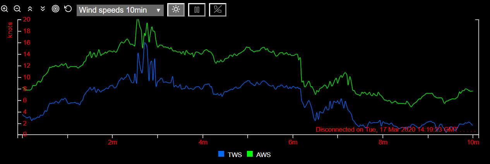

# signalk-stripcharts: generate strip charts from Signal K live boat data. 

A stripchart displays the most recent boat data (from one or more Signal K paths) as a graph along a time axis (x-axis).
Legends identify by abbreviations what paths are charted. Here is a chart with a 10 minutes time window plotting the true wind speed (TWS) and apparent wind speed (AWS):



The above chart has a y-axis on the left hand side. Optionally, as shown on the chart below (right hand side), a y2-axis may also be defined with its own unit. The dotted line corresponds to the plot according to the y2 axis, here the apparent wind angle (AWA).


The browser window can display two such charts on top of each other. For instance you may have wind speeds on the top chart and boat speeds on the bottom chart. Those two charts can be selected with a dropdown list from a set of active charts.

Now it's time to install and start using the default charts specifications provided.

## Installation    ????

signalk-stripcharts comes with all required dependencies (including c3 charting library and d3 visualization library).

### Installation on a client-only device:
- create a local folder
- download from   (github)

### Installation on a node server (typically the boat Signal K server):
Use npm: [sudo] install signalk-stripcharts from

This will install signalk-stripcharts and its dependencies c3 and d3 under ./node_modules.  
(signalk-stripcharts , c3 and d3 must be under the same node_modules folder; any other configuration requires script elements in stripcharts.html to be edited in order to correctly point to the c3 and d3 assets).

signalk-stripcharts could be set as a Signal K Webbapp and started from the Signal K user interface.

## Basic usage

Go to the installed folder.   ???
Use ./index.html as a launch menu.
Here you can choose the Signal K server and choose a set of charts, then push the "Launch signalk-stripcharts " button.

When the charts are displayed:
- hover on a legend: the corresponding plot is highlighted, the others dimmed; the corresponding Signal K path is displayed above the legend
- hover on a plot line, tooltips are diplayed
- by clicking on a legend you can toggle the dim status of the legend and the corresponding plot

You may wish to bookmark the launched page(s) for easier later launching.
Modify the query parameters (server & specs) as needed, e.g. if you have defined your own charts psecifications (see later section "How it works").

### y- and y2-axis buttons

These buttons affect the size and position of the plotted lines corresponding to the axis :


From left to right: 
- zoom in
- zoom out
- raise the plot relative to the axis
- lower the plot relative to the axis
- try to center the plot at present time
- reset to the initial scale and position settings

### Drop-down list
You can select any chart in the set for display.
If you choose the same chart as the other one displayed, the chart will be displayed on the whole window.

### Main buttons


From left to right:
- toggle day/night display
- toggle pause/play plotting
- disconnect from Signal K server (reload the page if you want to connect again)

They apply to the whole window.

## How it works

The result is governed by some general options, the chart specifications and the units.

A chart is primarily specified by:
- a name
- the length of the time axis (timeWindow); typically 10 minutes, 2 hours or 24 hours
- the averaging period (further explained below)
- the y axis range and unit (unit conversion is taken care of)
- the same properties for the y2 axis, if present
- the list of Signal K paths to be charted

For each path the charted value can be the average, the maximum and/or the minimum of the values received from Signal K during the averaging period. The averaging period (avgInterval) should be set such that the ratio timeWindow/avgInterval is between 300 and 1000 (i.e. a reasonable number of plots along the timeWindow); avgInterval must be longer than the sampling period defined in the Signal K subscription period (subscribePolicy.period), which is typically 1 second. By default, the chart is refreshed every avgInterval (provided that some new data has come for that chart).
When data stops coming for a particular path, it is "hotdecked" from the last data received until new data arrives; hotdecking stops after twenty seconds and thereafter the corresponding data will be 0 (in Signal K unit) indicating probably that the corresponding instrument was disconnected or switched off.

A chart specification is provided as a javascript object.
Here is the specification for the chart shown at the top of this section:

```javascript
const Wind_speeds_10min = 
    { stripChartName: "Wind_speeds_10min",   // stripChartName MUST be same as the containing object name
        timeWindow: 600,            // 10min
        avgInterval: 2,             // 2 sec
        intervalsPerRefresh: 2,     // default 1
        x: { label: "min/sec ago", tickCount: 11 },   // a tick every min (10, + 1 for zero)
        y: { unit: "Knot" },
        paths: 
        [
            { path: "environment.wind.speedTrue", AVG: "TWS" },  // average is plotted, legend is "TWS"
            { path: "environment.wind.speedApparent", AVG: "AWS" }      
        ]
    }
;
```
By default, the chart is refreshed every avgInterval (provided that some new data has come); refreshing can be made slower with the intervalsPerRefresh property in order to spare some processing.

Related chart specifications objects are grouped into a set.

When the application is started, the following parameters must be provided:
- the address and port of the Signal K server (defaults to the address & port the page is loaded from)
- the file name containing the chart specifications set (without .js extension).

The application subscribes to the Signal K server deltas for all the paths in the set. The values are then continuously collected and aggregated for all charts in a set. At any one time, two charts can be displayed as selected by the user from drop down lists.
If the user selects the chart 'none' in one of the drop down lists, the remaining chart covers the whole window area.

Charts can be paused. When paused, data collection continues. So the charts display will catch up when "unpaused". When the chart window is minimized or not in view, the charts are paused likewise and will catch up when brought to view. This minimizes processing load.

There is no persistency: when the window is closed it is disconnected from Signal K and the buffers are "lost". In order to reconnect reload the page.

The charts specifications sets are each stored in a .js file in the ./specs folder.
The following specifications files are provided at installation:
- sail.js
- environment.js
- engines.js  (provided as an untested example ???)
Each of them can be started in its own browser tab and run concurrently.

New specifications files can be easily derived from those. Copy them and edit them with a text editor, or better with a code editor such as Geany or Visual Studio Code.
In a specification file, a chart can be derived from another and only the properties that differ need to be specified (e.g. a two-hours chart can be derived from a ten-minutes chart, with most of the properties inherited). Inheritance is provided at the first level of properties only.

Ample comments are provided in the installed specifications files for those features that were not explained above.
Additional documentation may be provided later as needed.

signalk-stripcharts buffers having no persistency, they cannot be used to store the history.
Persistency and more powerful charting capabilities can be provided with InfluxDB and Grafana as explained here (https://github.com/tkurki/signalk-to-influxdb/blob/master/README.md) or could be provided with the help of the history capability of Signal K if available.

## Customization
### Options
Options governing all charts are given in ./js/stripcharts_options.js.
See comments in the file.
### Chart specifications and colors
Ample comments are provided in the specification files.

The launch menu provides a button to list all paths and sources currently represented in the Signal K server.
Switch on all your instruments and systems in order to have a full list of what you can chart.

Colors can be specified per legend at the bottom of the chart specifications set in order to insure consistency accross multiple charts of a same set.
If not provided colors will be assigned automatically by the c3 library.
See sail.js for how to assign colors.
### Units
./specs/units provides the list of Signal K units and charting units, with the conversion factors and algorithms.
It also provides the following default properties for the y and y2 axis as a function of the charting unit:
- label
- range (min and max)
- tick count and format

Those can be overidden in the chart specs.

A special unit "Percent" is provided. It allows to plot values of different units on a same "Percent" y or y2 axis by providing reference values in the Signal K unit for 0% and for 100%. See engines.js for an example with comments.

## Browser compatibility  ???

## CPU requirements   ???

## Troubleshooting

Syntax errors in the charts specifications files will be caught by javascript.
Logical errors in the specs and errors in the data returned by Signal K may also be reported.
Inspect the console as needed.

Some tracing options are provided in ./js/stripcharts_options.js. Tracing occurs below the displayed charts.

## Functional improvements
- [ ] Filter by sources: in a chart specs, at path level, specify sources wanted as an array
- [ ] Filter out from the specs the path/sources which are never provided by the signalk server and/or derive missing path values from other paths when possible

## Technical improvements
signalk-stripcharts is essentially a html/javascript front-end application.
It was developed with no or very limited prior knowledge of Linux, Javascript, HTML, CSS, Signal K, Node.js and other js-related tools.
Therefore much technical improvement is of course possible.
In particular the following improvements could be considered without structural changes:
- [ ] Transpiling (Babel)  
- [ ] Minification.  
- [ ] Retrieval of boat data is inspired from Signal K websocket example. Possibly it could be replaced by the more robust https://www.npmjs.com/package/@signalk/client   

Any hints are most welcome.

## Credits
The following open source or free software contributions have been especially inspiring:
- NavMonPC stripcharts: http://www.navmonpc.com/
- Signal K: http://signalk.org/
- c3.js: https://c3js.org/

Thank you to all who have shown the way!
