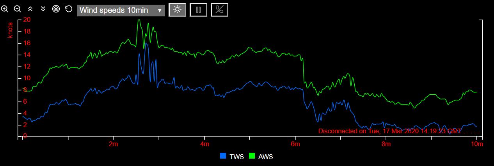

# signalk-stripcharts: generate strip charts from Signal K live boat data. 

A stripchart displays the most recent boat data (from one or more Signal K paths) as a graph along a time axis (x-axis).
Legends identify by abbreviations what paths are charted. Here is a chart with a 10 minutes time window:

The above chart has a y-axis on the left hand side. Optionally, as shown on the chart below (right hand side), a y2-axis may also be defined with distinct units. The dotted line corresponds to the plot according to the y2 axis, here the apparent wind angle (AWA).
